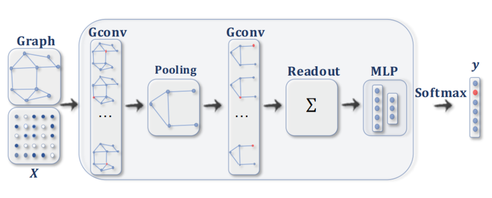

# Graph Neural Networks for Graph Classification Benchmark [](https://github.com/GerardTho/ML_research_seminar/actions/workflows/prod.yml) [](https://github.com/GerardTho/ML_research_seminar/actions/workflows/publish.yml) [](https://github.com/GerardTho/ML_research_seminar/actions/workflows/lint.yml) [](https://github.com/GerardTho/ML_research_seminar/actions/workflows/spellcheck.yml)

This project aims to compare the interactions between convolutional, pooling and readout layers on a graph classification task.



This is a simplified version of an original research project done for the M2DS course : ML research seminar (https://github.com/AntoineTSP/ML_research_seminar/tree/main).

# Links

API : https://tgerard.kub.sspcloud.fr/docs (you might want to download some data to do inference)

Website : https://gerardtho.github.io/ML_research_seminar/

Gitops repo : https://github.com/GerardTho/gnn-deployment

# Reproduce results in local

## Credentials

If you are not using an ssp cloud service, you might need to add your credentials in a .env file to run the steps in local (.env_example is a template)

## Environment

```
pip install -r requirements.txt
```

## Download data

The data is available on an ssp cloud bucket which can be modified in data/config.yml. It can be automatically downloaded using :

```
python data/download_data.py 
```

If you are not on an ssp-cloud instance this step will take a lot of time.

## Train the pipeline

To retrain all the models of the pipeline run :

```
python main.py
```

The configs/config.yml will monitor the different layers to put in the models. Only some layers are supported.

One also needs to place the config templates inside the folder for each different dataset.

The training can then be monitored using tensorboard on the ULR http://localhost:6006/ after running the command :

```
tensorboard --logdir="logs/runs"
```

## Local API

One can access a local API on http://localhost:5000/ after running the command :

```
uvicorn api.main:app --reload --host "0.0.0.0" --port 5000
```

## Train one model

If you want to only train one model, you can directly do this command specifying a custom config file.

```
python -m model.training_script -c configs/templates/MUTAG_test_template.yml
```

One has to properly fill the yml file following the templates.

## Adding other datasets 

Adding other datasets won't work as they are not available on the ssp-cloud bucket. However, one can change the bucket access in data/config.yml, even going on another platform should work as long as the endpoint is also changed in the .env file.

## Adding other layers

New layers of convolution or pooling can be added in model\layer_selector.py.

New layers of local pooling should also contained a dictionary indicating the order of the variables returned by the forward of the pooling layer. For instance the MEWISPooling has the dictionary : 

```
{'node_features':0,'edge_index':1,'batch':2, 'loss':3}
```

While the SAGPooling has the dictionary :

```
{'node_features':0,'edge_index':1,'batch':3}
```

Since the forward method of SAGPooling returns an edge_attributes values at the second place (which is useless to us), and similarly the MEWISPooling returns a 
loss at the third place that has to be taken into account.

# Project organization

```bash
│   .env_example
│   .gitignore
│   .spellcheck.yml
│   Dockerfile
│   index.qmd
│   install.sh
│   LICENSE
│   main.py
│   README.md
│   requirements.txt
│   styles.css
│   _quarto.yml
│
├───.github
│   │   wordlist.txt
│   │
│   └───workflows
│           lint.yml
│           prod.yml
│           publish.yml
│           spellcheck.yml
│
├───api
│       main.py
│       run.sh
│
├───chapters
│       Conclusion.qmd
│       Empirical results.qmd
│       Framework.qmd
│       Introduction.qmd
│       Slides.qmd
│
├───configs
│   │   config.yml
│   │
│   └───templates
│           ENZYMES_test_template.yml
│           MUTAG_test_template.yml
│           PROTEINS_test_template.yml
│
├───data
│   │   config.yml
│   │   data.py
│   │   download_data.py
│   │
│   └───homophily
│          homophily_data.csv
│          homophily_functions.py
│
├───deployment
│       deployment.yaml
│       ingress.yaml
│       service.yaml
│
├───images
│
├───model
│       GNN_model.py
│       layer_selector.py
│       mewisPool_layer.py
│       training_script.py
│
├───notebooks
│       gnn_mewispool.ipynb
│       Homophily.ipynb
│       wilcoxon_test.ipynb
│
└───visualisation
    │   plot_from_dict.py
    │   Resultats_graphiques_GNN.ipynb
    │
    ├───plot
    │       prepare_data.py
    │       save_plot.py
    │       to_table.py
    │       visualisation_plot.py
    │
    └───results

```
